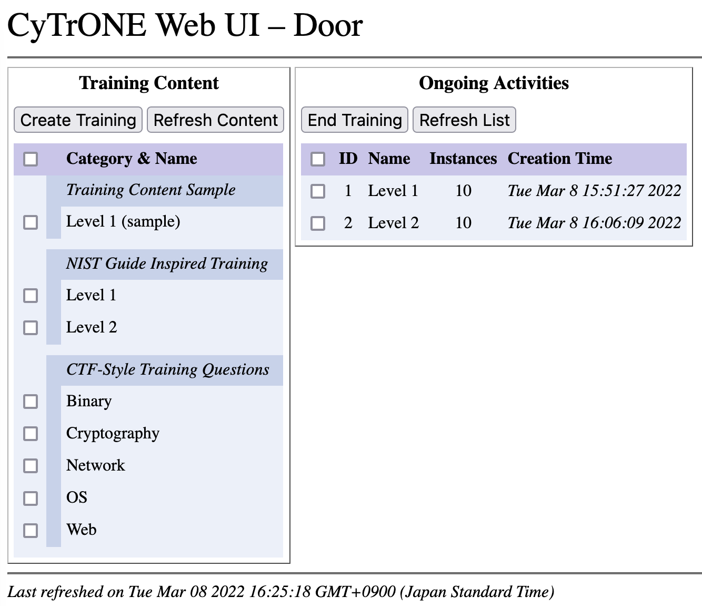

# CyTrONE Web UI: Web User Interface for CyTrONE

CyTrONE Web UI is a web browser user interface for the integrated
cybersecurity training framework
[CyTrONE](https://github.com/crond-jaist/cytrone). The interface is
intended for training instructors, who can use it to create new
training sessions and to terminate existing ones. CyTrONE Web UI is
being developed by the Cyber Range Organization and Design
([CROND](https://www.jaist.ac.jp/misc/crond/index-en.html))
NEC-endowed chair at the Japan Advanced Institute of Science and
Technology ([JAIST](https://www.jaist.ac.jp/english/)).

A screenshot of the web interface is shown in the figure below. In the
left-hand side panel existing training content is displayed, and the
**Create Session** button can be used to create a new training session
(the number of requested cyber range instances should be set via the
dialog box shown subsequently). The right-hand side panel displays the
active training sessions, and can be used to terminate them via the
**End Session** button. Both the training content and active sessions
panels can be refreshed by clicking the corresponding buttons in case
the data was updated externally (e.g., new content was added to
CyTrONE while the UI was running).



Next we provide brief information on how to setup and use CyTrONE Web
UI. For more details, please refer to the User Guide made available in
the [v0.3
release](https://github.com/crond-jaist/cytrone-ui-web/releases/tag/v0.3).


## Prerequisites

CyTrONE Web UI has been developed using the Perl programming language
on Ubuntu 18.04 LTS, so installing Perl is required if it is not
installed already. To do that, run the following command:
```
$ sudo apt-get install perl
```

Then the necessary Perl modules need to be installed, for example by
using the `cpan` command. The list of required Perl modules is as
follows:
* `Net::WebSocket::Server`
* `YAML::Tiny`
* `URI::Escape`
* `Digest::MD5`
* `Data::Dump`
* `LWP::Protocol::https`


## Setup

While there is no installation procedure for CyTrONE Web UI, changing
its settings according to your environment is necessary. This is
accomplished by creating a configuration file based on the template
provided in `door.conf.dist`; the key settings are explained below:

* Configure the address and port on which the UI will listen for web
  browser connections; for example, to make possible connecting via
  `http://192.168.1.1:8080`, you should specify the following
  settings:
  ```
  httpd_addr    192.168.1.1
  httpd_port    8080
  ```

* Configure the user name and password for connecting to the web UI;
  for example, to make possible connecting via the user `cy_user` and
  password `cy_passwd`, you should specify the following settings:
  ```
  httpd_userpasswd    cy_user cy_passwd
  ```
  Note that the user name and password specified here are also used to
  authenticate with CyTrONE, so these values must match those set for
  the CyTrONE server.

* Configure the settings used when the UI connects to the CyTrONE
  server; for example, to use the `https` protocol to connect locally
  (assuming the UI and CyTrONE are installed on the same host), and
  to retrieve English language content, use the following settings:
  ```
  trngsrv_proto    https
  trngsrv_host     127.0.0.1
  trngsrv_lang     en
  ```

Depending on the configuration of the SSL server certificate for your
CyTrONE server, such as in the case of using self-signed certificates,
you may also need to disable the host name verification in the Perl
SSL implementation via the following command:
```
$ export PERL_LWP_SSL_VERIFY_HOSTNAME=0
```


## Quick Start

In order to start CyTrONE Web UI, run the command below (assuming that
the configuration file you created above is named `door.conf`):
```
$ perl door.pl -f door.conf
```

The UI program can be stopped simply by entering `Ctrl-C` in the
terminal where it was started.

All the available command-line options can be viewed using the
argument `-h` when running the program:
```
$ perl door.pl -h
door.pl - A UI server for CyTrONE by k-chinen, CROND, JAIST. 2017-2018.
usage: door.pl [-f <file>] [options]
option:                                         ; default value
    -h          print this message              ;
    -v          print version                   ;
    -V          print parameters                ;
    -f file     read cofiguration file          ;
    -p port     HTTP service port number        ; 10080
    -a addr     HTTP service address            ; 127.0.0.1
                        URL http://127.0.0.1:10080/
    -c dirs     HTTP document root directories  ; htmldoc
    -P port     WS service port number          ; 12345
    -A addr     WS service address              ; 127.0.0.1
                        URL ws://127.0.0.1:12345/junk
    -d          debug mode                      ; 0
    -D string   debug-masking of module,protocol;
    -q          quiet mode                      ; 0
    -m          trace messages intro syslog     ; 0
    -z          sleep until client access       ;

example:
    % door.pl -p 4989 -P 3213 -c docroot
    % door.pl -f door.conf
```


## References

For more details about CyTrONE Web UI, including internal architecture
details, please refer to the User Guide made available in the [v0.3
release](https://github.com/crond-jaist/cytrone-ui-web/releases/tag/v0.3).

For a list of contributors to this project, please check the file
CONTRIBUTORS included with the source code.
